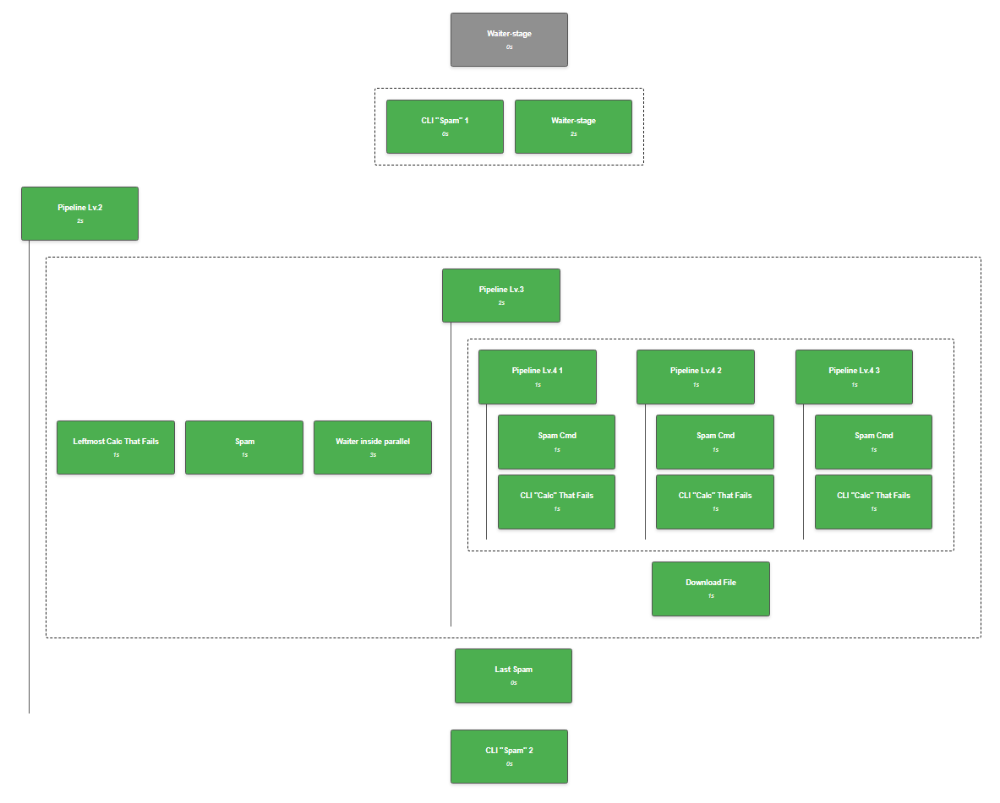

## Atlas Pipeline syntax and features

AtlasPipeline uses a declarative YAML syntax to define data processing workflows with support for sequential execution, parallel stages, and nested pipelines:



\* Example UI Rendering of [this pipeline](../tests/pipeline_configs/retry/pipeline_retry_1.yaml)

### Basic structure

```yaml
kind: AtlasPipeline
apiVersion: v2

pipeline:
  id: pipeline-1-cmd
  name: Simple 1-Cmd Pipeline
  vars:
    STAGE_TYPE_PY: PYTHON_MODULE

  stages:
    - name: Spam Cmd
      job: template-py-stage
      command: "spam"
      path: "optional/path/to/non-default-python-module"
      output:
        params:
          RESULT_SPAM: "params.some_insecure_param_3"

  jobs:
    template-py-stage:
      type: ${STAGE_TYPE_PY}

  configuration:
    output:
      params:
        params:
          CALC_RESULT: ${CALC_RESULT}
```

### Stage Types

AtlasPipeline supports four stage types:

1. `PYTHON_MODULE` - Execute Python commands from packaged modules
2. `SHELL_COMMAND` - Run shell commands and scripts
3. `PARALLEL_BLOCK` - Execute multiple stages concurrently (only used internally and in UI report, not specified explicitly in stage definition)
4. `ATLAS_PIPELINE_TRIGGER` - Invoke other AtlasPipeline definitions
5. `REPORT` - Inherits all properties of `PYTHON_MODULE`, but will also get current `execution_report.json` in it's `input_files` directory for further processing

### Module path

Stage has optional configurable `path` field - if it's not defined, it will be populated with value of `PIPELINES_DECLARATIVE_EXECUTOR_PYTHON_MODULE_PATH` env var during orchestration.
You can use this field to invoke commands from different "Python Modules", available inside your Docker image.
And you can omit it when working with one default "Python Module", that you've put to predefined env var during Docker image assembly.

### Inputs and Outputs

Stages can define complex input and output configurations.

Params support **variable substitution** - use `${VARIABLE}` syntax for dynamic values

There are three available sections for input/output parameters:

- `params` - for non-sensitive configuration (supports multi-level nesting)
- `params_secure` - for sensitive data (also supports nesting) (not available in `output` section - any params sourced from module's secure files will be marked as such automatically)
- `files` - for file-based inputs/outputs

You can use wildcard as a value (`*`) to capture all outputs
(these values could be referenced by their key in their original structure they are taken from.
e.g. your module produced output params file with `params.some_parent.some_key` structure inside,
value of this variable will be available under `some_key` in pipeline context):

```yaml
  output:
    params:
      params: "*"
```

Or specify variable names (as keys) and path inside output YAML (as value), where you'll be able to retrieve these values in the next stages:

```yaml
  output:
    params:
      SOME_VAR_NAME_WE_WILL_USE_IN_THE_NEXT_STAGES: "params.some_insecure_param_3"
      SOME_SECURE_PARAM: "params.secure_param_0"
```

When declaring file-based `output` - `files` section:

- Key is how this file/directory should be referenced by following stages if they want to use it in their input (in the following example - `FILES_THIS_STAGE_PRODUCED`)
- Value is local path inside stage where file/directory should be taken from (or `*` to take all produced files)

When declaring file-based `input` - `files` section:

- Key is referencing previously produced files (in the following example - `FILES_THIS_STAGE_PRODUCED`, or `FILE_FROM_PREVIOUS_STAGE`)
- Value is local path inside stage where file/directory should be placed

```yaml
- name: Example stage
  type: PYTHON_MODULE
  command: "spam"
  input:
    params:
      params:
        filename: README.${README_FORMAT}
        some_calced_param: ${PARAM1}_${PARAM2}
    params_secure:
      system:
        git:
          password: qwerty123
    files:
      "FILE_FROM_PREVIOUS_STAGE": "local/path/where/it/will/be/placed"
  output:
    params:
      RESULT_1: "params.some_insecure_param_3"
    files:
      "FILES_THIS_STAGE_PRODUCED": "*"
```

### Jobs (aka 'Stage templates')

Define reusable job configurations in the jobs section of your pipeline:

```yaml
jobs:
  template-py-stage:
    type: PYTHON_MODULE
  
  template-shell-stage:
    type: SHELL_COMMAND
    path: "/bin/bash"
```

### Variable Substitution

Use `${VARIABLE_NAME}` syntax for dynamic values throughout the pipeline:

```yaml
vars:
  README_FORMAT: "md"
  CALC_OPERATION: "add"

stages:
  - name: Example Stage
    input:
      params:
        filename: README.${README_FORMAT}
        operation: ${CALC_OPERATION}
```

### 'When' Conditions

Declare conditions that defined whether the stage will be executed or not:

```yaml
- name: Stage with conditions
  type: PYTHON_MODULE
  command: "spam"
  when:
    statuses: SUCCESS, FAILED
    condition: "SOME_VARIABLE in ['allowed', 'values', 'list']"
```

### Parallel Execution

Use the `parallel` block to execute multiple stages concurrently:

```yaml
stages:
  - name: Parallel block with three stages
    parallel:
      - name: ....
        type: ....

      - name: ....
        type: ....

      - name: ....
        type: ....
```

Another, key-value based syntax is also supported for backward compatibility:

```yaml
stages:
  - name: Parallel block with three stages (key-value version)
    parallel:
      id_of_p0:
        name: ....
        type: ....

      id_of_p1:
        name: ....
        type: ....

      id_of_p2:
        name: ....
        type: ....
```

If you are collecting output params from parallel stages, be sure to collect them with different names - otherwise, you might end up with stages overwriting same variable in pipeline's context.

### Nested Pipelines

Nested pipelines (aka "Atlas Pipeline Triggers") allow you to reuse pipeline definitions and create hierarchical workflows by invoking another pipeline from the current one:

```yaml
- name: Nested Pipeline
  type: ATLAS_PIPELINE_TRIGGER
  input:
    pipeline_data: "path/to/nested_pipeline.yaml"
    pipeline_vars: |
      VAR1 = value1
      VAR2 = value2
  output:
    params:
      RESULT_FROM_NESTED: "params.output_variable"
    files:
      ALL_FILES: "*"
```

### Pipeline Output

You can define pipeline's output via `configuration.output` section. There are [three subsections](#inputs-and-outputs) available: `params`, `params_secure` and `files`.
Output is generated the same way input for "Python Modules" is.
Pipeline's output is used in [Nested Pipelines](#nested-pipelines) (it's passed to parent pipeline, if output is requested via output declaration) and in the [resulting pipeline artifacts](#execution-directory-structure).

```yaml
kind: AtlasPipeline
apiVersion: v2

pipeline:
  stages:
    - ...
    - ...

  configuration:
    output:
      params:
        CALC_RESULT: ${CALC_RESULT}
        nested_section:
          another_param: value
      params_secure:
        SOME_SECURE_PARAM: ${SOME_TOKEN}
      files:
        
```

### Execution Directory Structure

Pipeline execution directory has the following structure:

```text
PIPELINE_DIR (temp-generated, or the one you passed in args)
├── 0_your_first_stage
├── 1_your_second_stage
├── ...
├── pipeline_output
│   ├── output_files
│   ├── output_params.yaml
│   └── output_params_secure.yaml
├── pipeline_state
│   ├── execution.json
│   ├── pipeline.json
│   ├── pipeline_report.json
│   └── vars.json
└── execution.log
...
full_execution.log (in your current workdir)
```

Each "Python Module" stage gets its own directory, where its `context.yaml` and input params will be stored and processed. Individual stage logs are also available in these folders.

`pipeline_output` folder contains data requested in [Pipeline Output configuration](#pipeline-output). This folder is present even if no output is configured.

`pipeline_state` stores current pipeline serialized state inside (among different files, depending on pipeline structure).
It also contains `pipeline_report.json` - aggregated report, intended to be viewed in UI, with all secure values masked. It's sent via [reporting module](../README.md#reporting).

When pipeline is executed inside general CI engines, common approach is producing following artifacts:

- `PIPELINE_OUTPUT` directory - to be processed by other pipelines or manually, secure_params here are encrypted by SOPS
- `PIPELINE_DIR` - whole "PIPELINE_DIR", but archived and protected with SOPS-based password, intended to be used in retry-case, or for debugging
- `pipeline_report.json` - from "pipeline_state/pipeline_report.json"
- `full_execution.log` - complete execution log file, including orchestration process.
